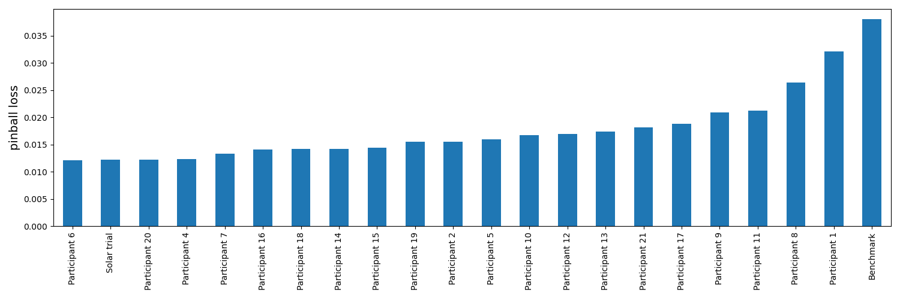
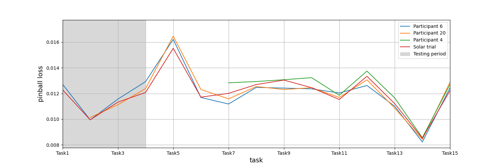

# power-forecast

## Introduction
This code, `gbdt-forecast`, is a method for energy and weather forecasting using gradient boosting decision trees. It considers the forecasting problem as a tabular problem without the  spatio-temporal aspects included in the modelling prior. Instead spatio-temporal features can be included as features in the tabular data. The code integrates four most popular gradient boosting implementations: 

##### 1) [`lightgbm`](https://lightgbm.readthedocs.io/en/latest/) ([Link to paper](https://papers.nips.cc/paper/6907-lightgbm-a-highly-efficient-gradient-boosting-decision-tree.pdf))
##### 2) [`xgboost`](https://xgboost.readthedocs.io/en/latest/) ([Link to paper](https://arxiv.org/pdf/1603.02754.pdf))
##### 3) [`catboost`](https://catboost.ai/) ([Link to paper](https://arxiv.org/pdf/1706.09516.pdf))
##### 4) [`scikit-learn`](https://scikit-learn.org/stable/modules/generated/sklearn.ensemble.GradientBoostingRegressor.html#sklearn.ensemble.GradientBoostingRegressor)

## Results
### Solar power forecasting



### Wind power forecasting
* Comparison with winners of the GEFCOM2014 competition
* Solar power forecast and comparison with physical. 
* Sensitivity analysis of adding more data
The code 

## Quick start
Download the [GEFCom2014 data](https://drive.google.com/file/d/1gKSe-OMVICQ5ZcBD_jvtAPRuamTFwFqI/view?usp=sharing) and place the file `1-s2.0-S0169207016000133-mmc1.zip` in the `data` folder. 

To replicate the results above run the following scripts:

```
./run_gefcom2014_load.sh
./run_gefcom2014_solar.sh
./run_gefcom2014_wind.sh
```

The results will be saved to the `results` folder and plots will be saved to `plots` folder. 

## Walkthrough of the pipeline

### 1) Download data
Download the [GEFCom2014 data](https://drive.google.com/file/d/1gKSe-OMVICQ5ZcBD_jvtAPRuamTFwFqI/view?usp=sharing) and place the file `1-s2.0-S0169207016000133-mmc1.zip`in the `data` folder. 

### 2) Extract data
Extract the data by running: 

```
python preprocess/extract_gefcom2014_wind_solar_load.py
```

the raw data files will be saved to: 

```
Wind track data saved to: ./data/raw/gefcom2014-wind-raw.csv
Solar track data saved to: ./data/raw/gefcom2014-solar-raw.csv
Load track data saved to: ./data/raw/gefcom2014-load-raw.csv
```

## 3) Preprocessing the GEFCom2014 data
Next step is to preprocess the data with feature extraction relavent for the forecasting task at hand. This repo includes examples of feature extraction for the different GEFCom2014 tracks: 

```
preprocess/preprocess_gefcom2014_wind_example.py
preprocess/preprocess_gefcom2014_solar_example.py
preprocess/preprocess_gefcom2014_load_example.py
```

These preprocessing scripts should be updated with the relevant feature engineering and takes input from the parameter files. To run the preprocessing script for the wind track (other tracks are analog) as: 

```
python preprocess/preprocess_gefcom2014_wind_example.py params/params_competition_gefcom2014_wind_example.json
```

the processed data file will be saved to: 

```
Wind track preprocessed data saved to: ./data/gefcom2014/preprocessed/gefcom2014-wind-preprocessed.csv
```

## 3) Train models and predict 
To train models, predict and save the results run the following script:

```
python ./main.py params/params_competition_gefcom2014_wind_example.json
```

The results will be saved to the `results` folder. 

## 4) Generate plots
Lastly, generate plots

## References

### Papers
[1] [Friedman, J. H. "Greedy Function Approximation: A Gradient Boosting Machine"](https://statweb.stanford.edu/~jhf/ftp/trebst.pdf)
<br>The original paper on gradient boosting.

[2] [Friedman, J. H. "Stochastic Gradient Boosting"](https://statweb.stanford.edu/~jhf/ftp/stobst.pdf)
<br>

[3] [Ke G. et. al. "LightGBM: A Highly Efficient Gradient Boosting Decision Tree"](https://papers.nips.cc/paper/6907-lightgbm-a-highly-efficient-gradient-boosting-decision-tree.pdf)

[4] [Chen T. and Guestrin, C. ,"XGBoost: A Scalable Tree Boosting System"](https://arxiv.org/pdf/1603.02754.pdf)

[5] [Anghel A. et. al. "Benchmarking and Optimization of Gradient Boosting Decision Tree Algorithms"](https://arxiv.org/pdf/1809.04559.pdf)

### Books
[Hastie, T. Tibshirani R. Friedman J. "The Elements of Statistical Learning"](https://web.stanford.edu/~hastie/Papers/ESLII.pdf)
<br> Great book for understanding of gradient boosting.

### Videos
[Trevor Hastie - Gradient Boosting Machine Learning](https://youtu.be/wPqtzj5VZus)
[Peter Prettenhofer - Gradient Boosted Regression Trees in scikit-learn](https://youtu.be/IXZKgIsZRm0)
[XGBoost: A Scalable Tree Boosting System](https://youtu.be/8Y-droPeKu8)
[CatBoost - the new generation of gradient boosting - Anna Veronika Dorogush](https://youtu.be/8o0e-r0B5xQ)
[Anna Veronika Dorogush: Mastering gradient boosting with CatBoost | PyData London 2019](https://youtu.be/usdEWSDisS0)
[Crunching Your Data with CatBoost - the New Gradient Boosting Library - Vasily Ershov](https://youtu.be/37wdnpdyls4)

### Blog posts
[CatBoost vs. Light GBM vs. XGBoost](https://towardsdatascience.com/catboost-vs-light-gbm-vs-xgboost-5f93620723db)
[XGBoost, LightGBM or CatBoost — which boosting algorithm should I use?](https://medium.com/riskified-technology/xgboost-lightgbm-or-catboost-which-boosting-algorithm-should-i-use-e7fda7bb36bc)
